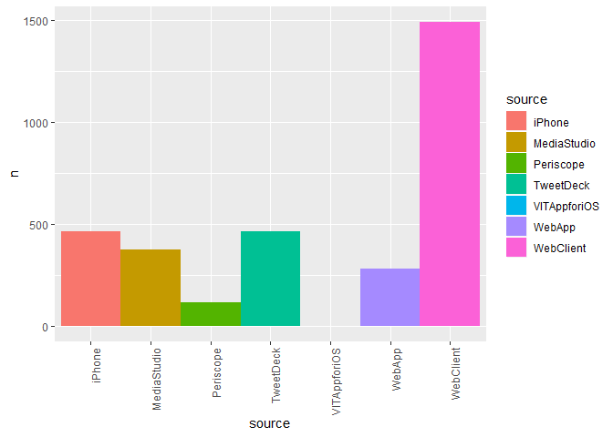
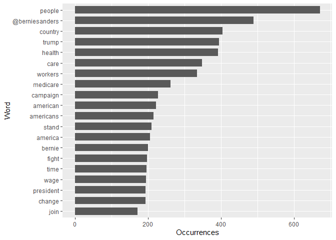
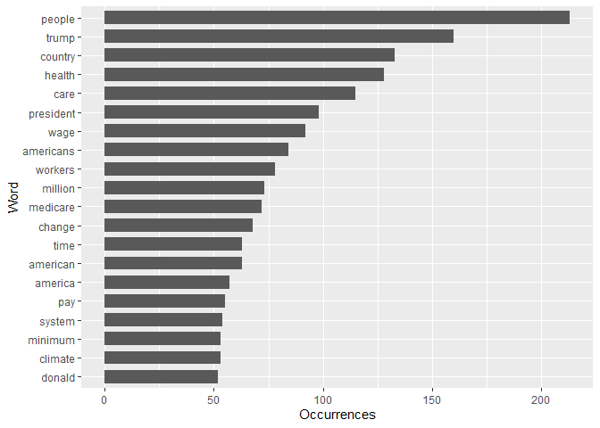
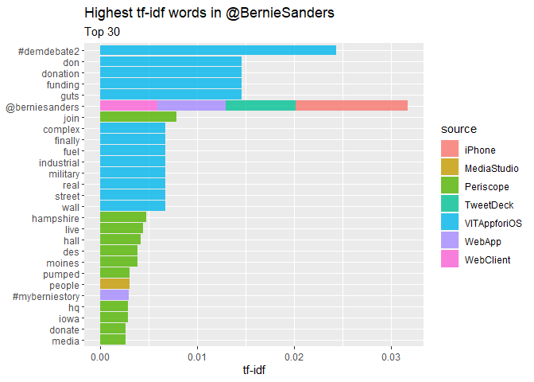
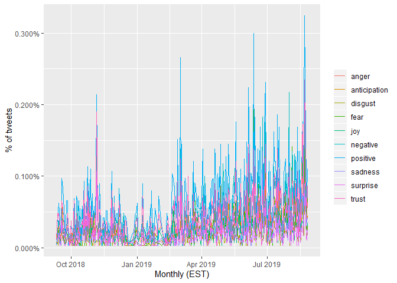
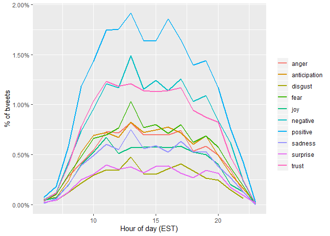
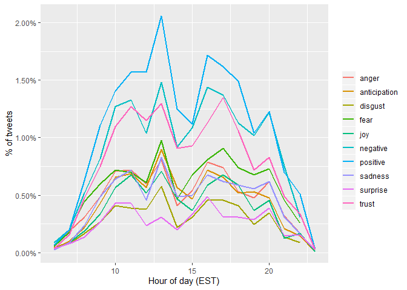

BernieTweet
================

``` r
library(rtweet)
library(stringr)
library(dplyr)
library(tidyverse)
library(lubridate)
library(scales)
library(tidytext)
```

## Get Bernie Sanders timeline

``` r
tmls <- get_timelines('BernieSanders', n = 3200)
tweets <- tmls %>% select(status_id, source, text, created_at) 
tweets <- mutate(tweets,source =ifelse(str_detect(tweets$source,'(?<=Twitter )[^.]*')==TRUE,str_match(tweets$source, '(?<=Twitter )[^.]*'), tweets$source))
```

## Show source of tweets

    ## # A tibble: 7 x 2
    ##   source           n
    ##   <chr>        <int>
    ## 1 iPhone         434
    ## 2 MediaStudio    359
    ## 3 Periscope      100
    ## 4 TweetDeck      437
    ## 5 VITAppforiOS     2
    ## 6 WebApp         180
    ## 7 WebClient     1687

## Bar plot

BernieSanders Web Client is the most used source to make tweets, Tweet
Deck coming in second and iPhone coming in third place.

<!-- -->

## Hourly

Usual time of the day where Twitter source is made from:

<!-- -->

## Pictures

<!-- --> \#\#
Top 5 hashtags
    used

    ## Using `to_lower = TRUE` with `token = 'tweets'` may not preserve URLs.

    ## # A tibble: 5 x 2
    ##   word                    n
    ##   <chr>               <int>
    ## 1 #medicareforall        67
    ## 2 #demdebate             42
    ## 3 #bernie2020            41
    ## 4 #nomiddleground        38
    ## 5 #organizewithbernie    36

## Word Sentiment

The top 20 words used in the 3200 tweets made by BernieSanders with each
frequency
<!-- --> \#\#
Term Frequency–Inverse Document Frequency,

    ## # A tibble: 7 x 2
    ##   source       total
    ##   <chr>        <int>
    ## 1 iPhone        5831
    ## 2 MediaStudio   4278
    ## 3 Periscope     1071
    ## 4 TweetDeck     5932
    ## 5 VITAppforiOS    23
    ## 6 WebApp        2386
    ## 7 WebClient    24155

    ## Joining, by = "source"

    ## # A tibble: 12,465 x 6
    ##    source       word               n     tf   idf tf_idf
    ##    <chr>        <chr>          <int>  <dbl> <dbl>  <dbl>
    ##  1 VITAppforiOS #demdebate2        1 0.0435 0.560 0.0243
    ##  2 VITAppforiOS complex            1 0.0435 0.560 0.0243
    ##  3 VITAppforiOS don                1 0.0435 0.560 0.0243
    ##  4 VITAppforiOS donation           1 0.0435 0.336 0.0146
    ##  5 VITAppforiOS finally            1 0.0435 0.336 0.0146
    ##  6 VITAppforiOS funding            1 0.0435 0.336 0.0146
    ##  7 VITAppforiOS guts               1 0.0435 0.336 0.0146
    ##  8 VITAppforiOS industrial         1 0.0435 0.336 0.0146
    ##  9 VITAppforiOS military           1 0.0435 0.336 0.0146
    ## 10 iPhone       @berniesanders   119 0.0204 0.560 0.0114
    ## # ... with 12,455 more rows

<!-- --> \#\#
Sentiment analysis \#\# 8 emotions (anger, fear, anticipation, trust,
surprise, sadness, joy, and disgust) \#\# 2 sentiments (negative and
positive) \#\#\# emolex downloaded from
<http://saifmohammad.com/Lexicons/> We are looking at the percentage of
tweets where each sentiment is shown during the hour of the day A
positive sentiment is the highest percentage of tweets

    ## Parsed with column specification:
    ## cols(
    ##   X1 = col_character(),
    ##   X2 = col_character(),
    ##   X3 = col_double()
    ## )

<!-- --><!-- --><!-- -->

## We can look at the past month for a better view

<!-- -->

## Better?

<!-- -->

## Sentiments per source

    ## # A tibble: 3,102 x 3
    ##    status_id           source    total_words
    ##    <chr>               <chr>           <int>
    ##  1 1026931745957052417 WebClient       24155
    ##  2 1026931885048516609 WebClient       24155
    ##  3 1026932172253483013 WebClient       24155
    ##  4 1026942223542378497 WebClient       24155
    ##  5 1027032223604793344 WebClient       24155
    ##  6 1027355179593728000 WebClient       24155
    ##  7 1027359589321388035 WebClient       24155
    ##  8 1027359911070654465 WebClient       24155
    ##  9 1027361685357637635 WebClient       24155
    ## 10 1027388870093090816 WebClient       24155
    ## # ... with 3,092 more rows

    ## # A tibble: 6 x 4
    ##   source emotion      total_words words
    ##   <chr>  <chr>              <int> <dbl>
    ## 1 iPhone anger               5831   299
    ## 2 iPhone anticipation        5831   343
    ## 3 iPhone disgust             5831   146
    ## 4 iPhone fear                5831   350
    ## 5 iPhone joy                 5831   275
    ## 6 iPhone negative            5831   533

<!-- --><!-- -->

## 

    ## Warning: Column `word` joining factor and character vector, coercing into
    ## character vector

<!-- -->

    ## Warning: Column `word` joining factor and character vector, coercing into
    ## character vector

<!-- -->

    ## 
    ## Attaching package: 'reshape2'

    ## The following object is masked from 'package:tidyr':
    ## 
    ##     smiths

    ## Loading required package: RColorBrewer

    ## Warning in comparison.cloud(., max.words = 100, colors = c("blue", "red")):
    ## @berniesanders could not be fit on page. It will not be plotted.

    ## Warning in comparison.cloud(., max.words = 100, colors = c("blue", "red")):
    ## class could not be fit on page. It will not be plotted.

    ## Warning in comparison.cloud(., max.words = 100, colors = c("blue", "red")):
    ## corporate could not be fit on page. It will not be plotted.

    ## Warning in comparison.cloud(., max.words = 100, colors = c("blue", "red")):
    ## corporations could not be fit on page. It will not be plotted.

    ## Warning in comparison.cloud(., max.words = 100, colors = c("blue", "red")):
    ## billionaires could not be fit on page. It will not be plotted.

    ## Warning in comparison.cloud(., max.words = 100, colors = c("blue", "red")):
    ## obstruction could not be fit on page. It will not be plotted.

    ## Warning in comparison.cloud(., max.words = 100, colors = c("blue", "red")):
    ## transform could not be fit on page. It will not be plotted.

    ## Warning in comparison.cloud(., max.words = 100, colors = c("blue", "red")):
    ## political could not be fit on page. It will not be plotted.

    ## Warning in comparison.cloud(., max.words = 100, colors = c("blue", "red")):
    ## @foxandfriends could not be fit on page. It will not be plotted.

    ## Warning in comparison.cloud(., max.words = 100, colors = c("blue", "red")):
    ## family could not be fit on page. It will not be plotted.

    ## Warning in comparison.cloud(., max.words = 100, colors = c("blue", "red")):
    ## support could not be fit on page. It will not be plotted.

    ## Warning in comparison.cloud(., max.words = 100, colors = c("blue", "red")):
    ## social could not be fit on page. It will not be plotted.

    ## Warning in comparison.cloud(., max.words = 100, colors = c("blue", "red")):
    ## companies could not be fit on page. It will not be plotted.

    ## Warning in comparison.cloud(., max.words = 100, colors = c("blue", "red")):
    ## vermont could not be fit on page. It will not be plotted.

    ## Warning in comparison.cloud(., max.words = 100, colors = c("blue", "red")):
    ## #medicareforall could not be fit on page. It will not be plotted.

    ## Warning in comparison.cloud(., max.words = 100, colors = c("blue", "red")):
    ## student could not be fit on page. It will not be plotted.

    ## Warning in comparison.cloud(., max.words = 100, colors = c("blue", "red")):
    ## walmart could not be fit on page. It will not be plotted.

    ## Warning in comparison.cloud(., max.words = 100, colors = c("blue", "red")):
    ## gun could not be fit on page. It will not be plotted.

    ## Warning in comparison.cloud(., max.words = 100, colors = c("blue", "red")):
    ## wages could not be fit on page. It will not be plotted.

    ## Warning in comparison.cloud(., max.words = 100, colors = c("blue", "red")):
    ## guarantee could not be fit on page. It will not be plotted.

    ## Warning in comparison.cloud(., max.words = 100, colors = c("blue", "red")):
    ## planet could not be fit on page. It will not be plotted.

<!-- -->
