BernieTweet
================

Libraries needed:

``` r
library(rtweet)
library(stringr)
library(dplyr)
library(tidyverse)
library(lubridate)
library(scales)
library(tidytext)
```

## Get Bernie Sanders timeline

``` r
tmls <- get_timelines('BernieSanders', n = 3200)
tweets <- tmls %>% select(status_id, source, text, created_at, favorite_count, retweet_count) 
tweets <- mutate(tweets,source =ifelse(str_detect(tweets$source,'(?<=Twitter )[^.]*')==TRUE,str_match(tweets$source, '(?<=Twitter )[^.]*'), tweets$source))
```

## Show source of tweets from @BernieSanders

    ## # A tibble: 7 x 2
    ##   source           n
    ##   <chr>        <int>
    ## 1 iPhone         465
    ## 2 MediaStudio    377
    ## 3 Periscope      115
    ## 4 TweetDeck      465
    ## 5 VITAppforiOS     2
    ## 6 WebApp         283
    ## 7 WebClient     1492

## Bar plot

Web Client is the most used source to make tweets, Tweet Deck coming in
second and iPhone coming in third place.

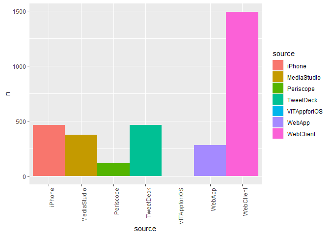<!-- -->

## Hourly

Usual time of the day where Twitter source is made from:

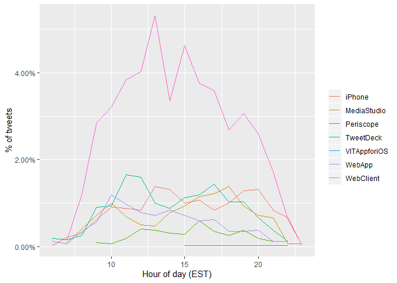<!-- -->

## Favorite Tweets

According to users, these are BernieSanders favorites tweets:

``` r
#favorites
print('Most favorited Tweet:')
```

    ## [1] "Most favorited Tweet:"

``` r
tweets[which.max(tweets$favorite_count), ]$text 
```

    ## [1] "Donald Trump believes climate change is a hoax. Donald Trump is an idiot."

``` r
print('Least favorited Tweet:')
```

    ## [1] "Least favorited Tweet:"

``` r
tweets[which.min(tweets$favorite_count), ]$text
```

    ## [1] "Yes. And let’s start by getting @senatemajldr to schedule a vote on S.27 - American Miners Act of 2019. We need to keep our promises. @MineWorkers earned these pensions and healthcare. \nhttps://t.co/98W2UoFg0H https://t.co/HFh1wE9FMi"

``` r
fav_tweets <- tweets %>% filter(favorite_count > mean(tweets$favorite_count))
count(fav_tweets)
```

    ## # A tibble: 1 x 1
    ##       n
    ##   <int>
    ## 1   846

``` r
#retweet
print('Most retweeted Tweet:')
```

    ## [1] "Most retweeted Tweet:"

``` r
tweets[which.max(tweets$retweet_count), ]$text
```

    ## [1] "Donald Trump believes climate change is a hoax. Donald Trump is an idiot."

``` r
print('Least retweeted Tweet:')
```

    ## [1] "Least retweeted Tweet:"

``` r
tweets[which.min(tweets$retweet_count), ]$text
```

    ## [1] "Finishing off the day in Rutland!Thank you @BernieSanders for bringing us all together today, especially in light of the news out of DC. #vtpoli"

``` r
re_tweets <- tweets %>% filter(retweet_count > mean(tweets$retweet_count))
count(re_tweets)
```

    ## # A tibble: 1 x 1
    ##       n
    ##   <int>
    ## 1   807

## Top 5 hashtags used

    ## Using `to_lower = TRUE` with `token = 'tweets'` may not preserve URLs.

    ## # A tibble: 5 x 2
    ##   word                    n
    ##   <chr>               <int>
    ## 1 #medicareforall        68
    ## 2 #bernie2020            44
    ## 3 #demdebate             42
    ## 4 #nomiddleground        37
    ## 5 #organizewithbernie    36

## Word Sentiment

The top 20 words used in the 3200 tweets made by BernieSanders with each
frequency
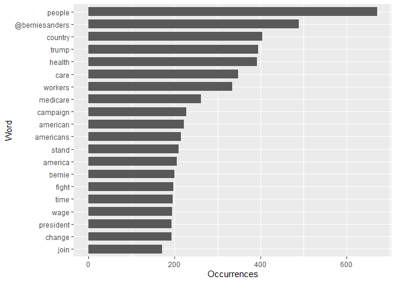<!-- -->

What about the top favorite tweets?
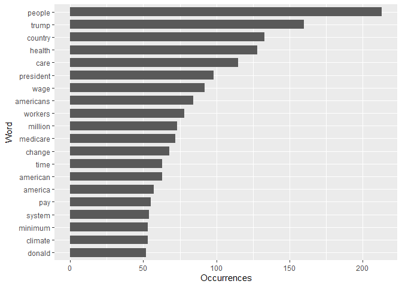<!-- -->

## Term Frequency–Inverse Document Frequency,

    ## # A tibble: 7 x 2
    ##   source       total
    ##   <chr>        <int>
    ## 1 iPhone        6343
    ## 2 MediaStudio   4504
    ## 3 Periscope     1291
    ## 4 TweetDeck     6313
    ## 5 VITAppforiOS    23
    ## 6 WebApp        4027
    ## 7 WebClient    21409

    ## Joining, by = "source"

    ## # A tibble: 13,057 x 6
    ##    source       word               n     tf   idf  tf_idf
    ##    <chr>        <chr>          <int>  <dbl> <dbl>   <dbl>
    ##  1 VITAppforiOS #demdebate2        1 0.0435 0.560 0.0243 
    ##  2 VITAppforiOS don                1 0.0435 0.336 0.0146 
    ##  3 VITAppforiOS donation           1 0.0435 0.336 0.0146 
    ##  4 VITAppforiOS funding            1 0.0435 0.336 0.0146 
    ##  5 VITAppforiOS guts               1 0.0435 0.336 0.0146 
    ##  6 iPhone       @berniesanders   131 0.0207 0.560 0.0116 
    ##  7 Periscope    join              66 0.0511 0.154 0.00788
    ##  8 TweetDeck    @berniesanders    81 0.0128 0.560 0.00718
    ##  9 WebApp       @berniesanders    51 0.0127 0.560 0.00709
    ## 10 VITAppforiOS complex            1 0.0435 0.154 0.00670
    ## # ... with 13,047 more rows

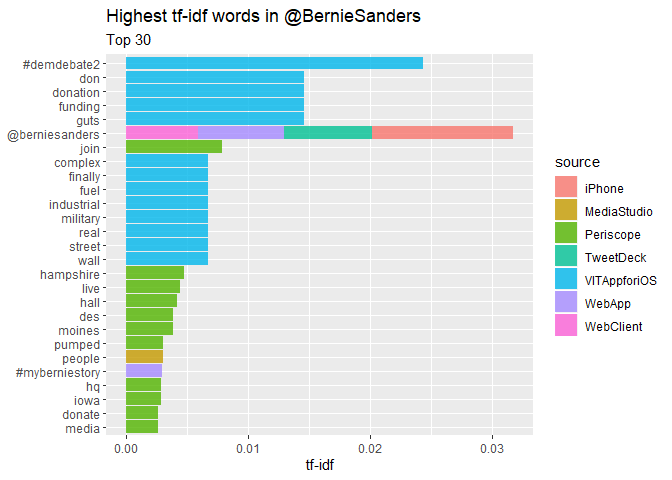<!-- -->

## Sentiment analysis

8 emotions (anger, fear, anticipation, trust, surprise, sadness, joy,
and disgust) 2 sentiments (negative and positive) **emolex downloaded
from <http://saifmohammad.com/Lexicons/>** We are looking at the
percentage of tweets where each sentiment is shown during the hour of
the day. A positive sentiment is the highest percentage of tweets

    ## Parsed with column specification:
    ## cols(
    ##   X1 = col_character(),
    ##   X2 = col_character(),
    ##   X3 = col_double()
    ## )

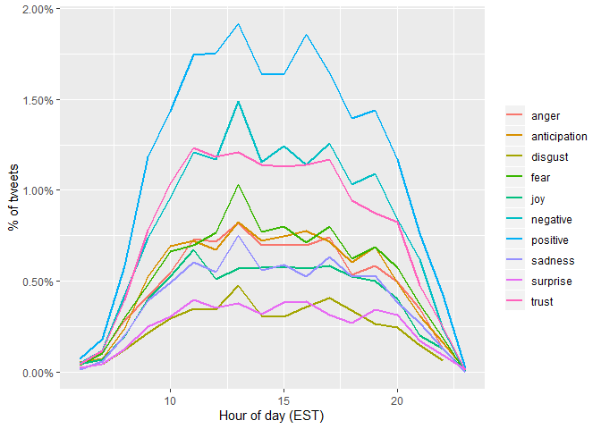<!-- -->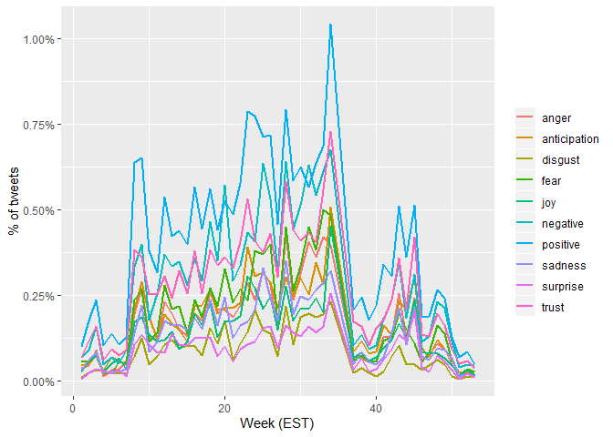<!-- -->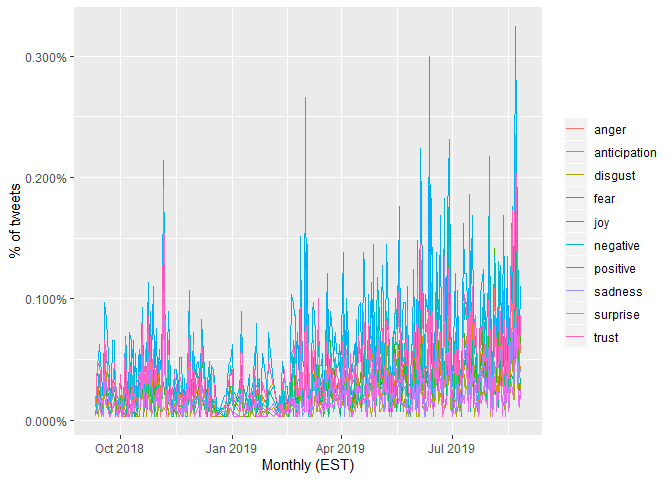<!-- -->

## We can look at the past month for a better view

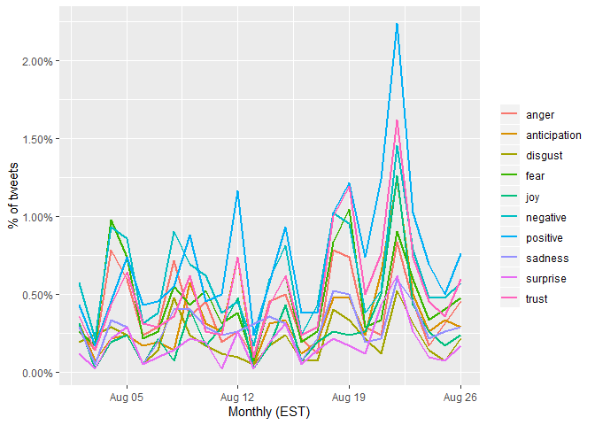<!-- -->

## Favorites?

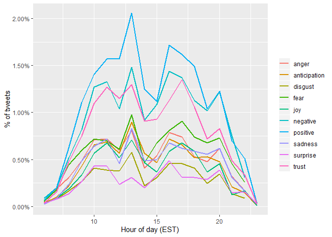<!-- -->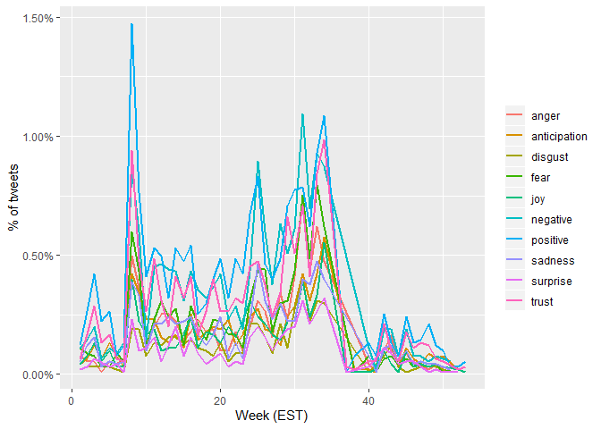<!-- -->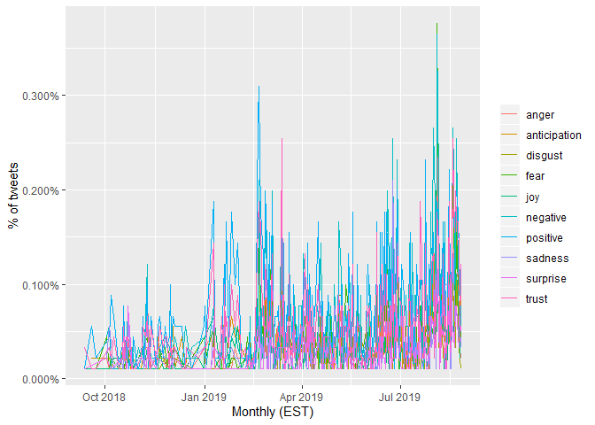<!-- -->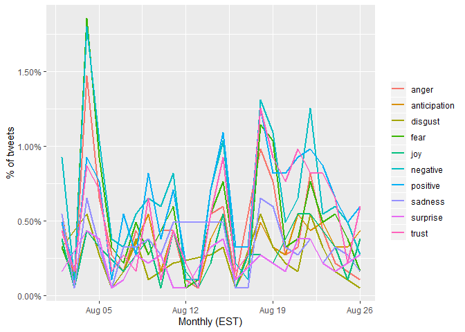<!-- -->

## Sentiments per source

    ## # A tibble: 3,101 x 3
    ##    status_id           source    total_words
    ##    <chr>               <chr>           <int>
    ##  1 1039662020990324736 WebClient       21409
    ##  2 1039668059735244800 WebClient       21409
    ##  3 1039940620746477570 WebClient       21409
    ##  4 1039986970468990981 WebClient       21409
    ##  5 1039994004342034438 WebClient       21409
    ##  6 1040018040048545810 WebClient       21409
    ##  7 1040029440091271170 WebClient       21409
    ##  8 1040040865782280192 WebClient       21409
    ##  9 1040046073962786821 WebClient       21409
    ## 10 1040226792605401090 WebClient       21409
    ## # ... with 3,091 more rows

    ## # A tibble: 6 x 4
    ##   source emotion      total_words words
    ##   <chr>  <chr>              <int> <dbl>
    ## 1 iPhone anger               6343   338
    ## 2 iPhone anticipation        6343   371
    ## 3 iPhone disgust             6343   163
    ## 4 iPhone fear                6343   391
    ## 5 iPhone joy                 6343   301
    ## 6 iPhone negative            6343   584

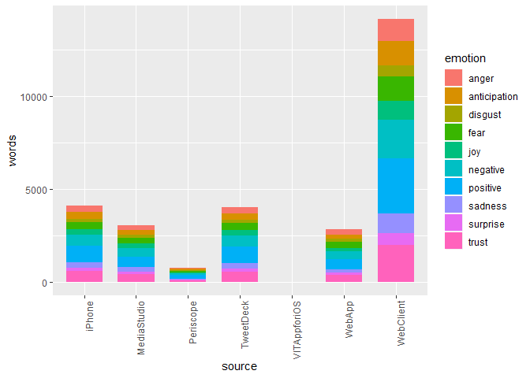<!-- -->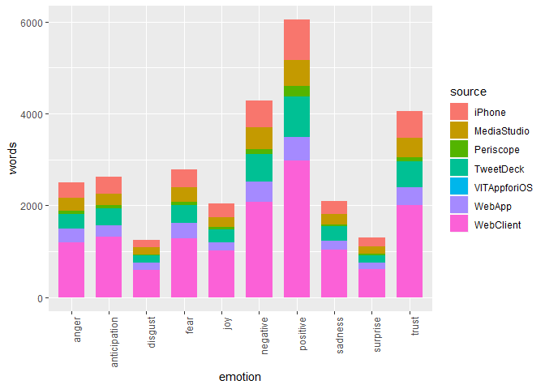<!-- -->

Compared to favorites, no huge difference except tweets from Periscope
source are less liked.

    ## # A tibble: 3,101 x 3
    ##    status_id           source    total_words
    ##    <chr>               <chr>           <int>
    ##  1 1039668059735244800 WebClient        5174
    ##  2 1042162683825541127 WebClient        5174
    ##  3 1043611807695421442 WebClient        5174
    ##  4 1046939970747940864 WebClient        5174
    ##  5 1047133156921479173 WebClient        5174
    ##  6 1048032131769929728 WebClient        5174
    ##  7 1048388524100276224 WebClient        5174
    ##  8 1048698035172196353 WebClient        5174
    ##  9 1049803479273811968 WebClient        5174
    ## 10 1051593847657119745 WebClient        5174
    ## # ... with 3,091 more rows

    ## # A tibble: 6 x 4
    ##   source emotion      total_words words
    ##   <chr>  <chr>              <int> <dbl>
    ## 1 iPhone anger               6343   122
    ## 2 iPhone anticipation        6343   103
    ## 3 iPhone disgust             6343    57
    ## 4 iPhone fear                6343   150
    ## 5 iPhone joy                 6343    91
    ## 6 iPhone negative            6343   224

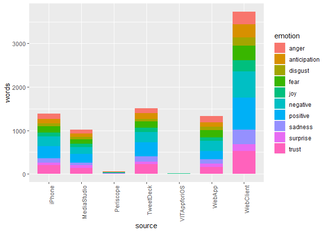<!-- -->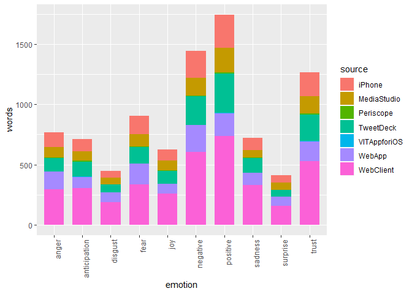<!-- -->
